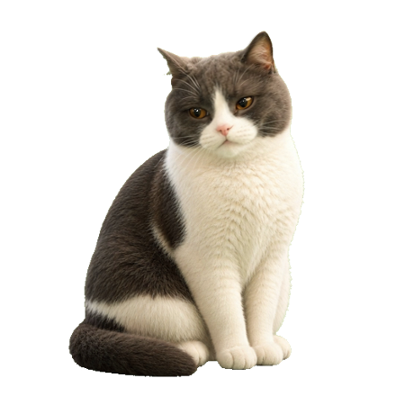
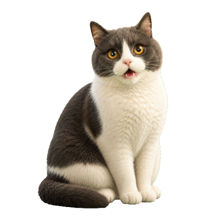
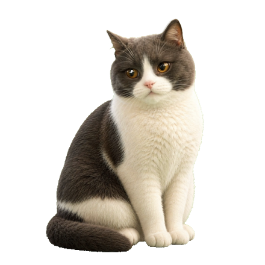
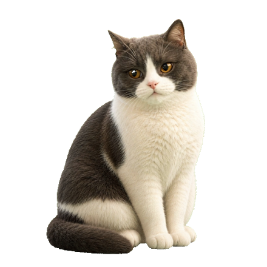
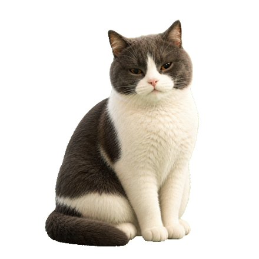

# 生成动作程序预览报告

日期：2026-06-18

## 结论

当前已接入程序的可灵生成动作共 16 个，均已通过 `YUZAI_PREVIEW_ACTION` 测试入口在桌面窗口中强制播放，并生成 440x440 PNG 预览截图。

本轮没有重新抽帧或覆盖 runtime 序列帧；重点是确认“已经生成并接入程序的动作”都能被程序主动播放，方便提前查看效果。

## 动作清单

| action | 分类 | 来源视频 | 程序预览截图 |
| --- | --- | --- | --- |
| `slow_blink` | daily | `assets/origin/generated/kling/slow_blink.mp4` |  |
| `look_around` | daily | `assets/origin/generated/kling/look_around.mp4` |  |
| `cursor_watch` | interactive | `assets/origin/generated/kling/cursor_watch_clean_candidate_v3.mp4` |  |
| `click_surprised` | interactive | `assets/origin/generated/kling/click_surprised.mp4` |  |
| `poke_annoyed` | interactive | `assets/origin/generated/kling/poke_annoyed.mp4` |  |
| `call_response` | interactive | `assets/origin/generated/kling/call_response.mp4` |  |
| `stretch_yawn` | daily | `assets/origin/generated/kling/stretch_yawn.mp4` |  |
| `groom_face_wash` | daily | `assets/origin/generated/kling/groom_face_wash.mp4` |  |
| `loaf_breathing` | daily | `assets/origin/generated/kling/loaf_breathing.mp4` |  |
| `desk_sniff` | daily | `assets/origin/generated/kling/desk_sniff.mp4` |  |
| `shy` | interactive | `assets/origin/generated/kling/shy.mp4` |  |
| `sleepy` | transition | `assets/origin/generated/kling/sleepy.mp4` |  |
| `sleep` | transition | `assets/origin/generated/kling/sleep.mp4` |  |
| `sleeping` | daily | `assets/origin/generated/kling/sleeping.mp4` |  |
| `waking` | transition | `assets/origin/generated/kling/waking.mp4` |  |
| `dragging` | interactive | `assets/origin/generated/kling/dragging.mp4` |  |

## 未采用的旧候选

以下 3 个视频是 `cursor_watch` 的旧候选，没有写入程序：

- `assets/origin/generated/kling/cursor_watch.mp4`
- `assets/origin/generated/kling/cursor_watch_clean_candidate.mp4`
- `assets/origin/generated/kling/cursor_watch_clean_candidate_v2.mp4`

当前程序使用 `assets/origin/generated/kling/cursor_watch_clean_candidate_v3.mp4`，原因是它是后续清理后的候选版本。

## 验证命令

```bash
npm run validate:action-preview-capture
YUZAI_PREVIEW_ACTION=<action> YUZAI_PREVIEW_ACTION_MS=500 YUZAI_CAPTURE_DELAY_MS=1400 YUZAI_CAPTURE_PATH=assets/reviews/runtime/generated-action-preview/<action>.png npm run dev
```

本轮已对 16 个 action 逐个执行桌面预览截图。文件完整性检查结果：16 张截图全部存在，均为 440x440 PNG，且 16 张截图哈希互不重复。

## 后续建议

下一步如果要评估“动作是否足够像预期”，建议按此报告逐张看图，再挑出需要重新生成视频的动作。重新生成前仍按原规则：先列清单，再确认，再处理素材。
